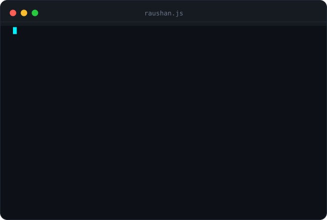

<!-- Profile README for Raushan Kumar -->

  

<h1 align="center">
  
</h1>

  
  
  
  
  

  

<!-- ═══════════════════════ SHORT VERSION ═══════════════════════ -->

  

  
  &nbsp;&nbsp;
  

 

  

  <table align="center">
    <thead align="center">
      <tr>
        <td><b>👀 Profile Views</b></td>
        <td><b>👤 GitHub Followers</b></td>
        <td><b>⭐ Total Stars</b></td>
        <td><b>🧩 Problem Solving</b></td>
      </tr>
    </thead>
    <tbody align="center">
      <tr>
        <td>
          
        </td>
        <td>
          
        </td>
        <td>
          
        </td>
        <td>
          
        </td>
      </tr>
    </tbody>
  </table>

  

  

### **Languages**

  
  
  
  
  
  
  

### **Backend & Architecture**

  
  
  
  
  

### **Frontend & UI**

  
  
  
  

### **Databases & Caching**

  
  
  

### **Tools & DevOps**

  
  
  
  
  
  
  

  

  

<table>
  <tr>
    <td width="50%" valign="top">
      <h3><code>01</code> <a href="https://github.com/Raushankumar0720/digital-twin-autopilot">Digital Twin Autopilot</a></h3>
      
<b>Autonomous AI persona clone & telemetry console with real-time event flow</b>

      

        
        
        
        
      

      <ul>
        <li><b>Telemetry Dashboard</b>: Single-page React/Vite console designed with executive telemetry panels.</li>
        <li><b>Low-Latency Inference</b>: Sub-second contextual persona replies powered by Groq LPU engine.</li>
        <li><b>Event Automation</b>: Real-time background listener daemon with automated contact whitelisting.</li>
        <li><b>Slang & Personality Dial</b>: Custom heuristic matching engine mimicking realistic conversational cadence.</li>
      </ul>
      
<b><a href="https://github.com/Raushankumar0720/digital-twin-autopilot">View Repository →</a></b>

    </td>
    <td width="50%" valign="top">
      <h3><code>02</code> <a href="https://github.com/Raushankumar0720/amazon_orders_raushan_kumar">Amazon Orders Analytics Backend</a></h3>
      
<b>Production-grade e-commerce analytics backend with MongoDB aggregation pipelines</b>

      

        
        
        
        
      

      <ul>
        <li><b>Scalable MVC Architecture</b>: Clean separation between routing, controllers, and data services.</li>
        <li><b>Advanced Aggregations</b>: Multi-stage pipeline computing dynamic revenue, volume, and customer trends.</li>
        <li><b>Query Engine</b>: Cursor-based pagination, multi-field filtering, and price-range sorting.</li>
        <li><b>JWT Security</b>: Role-based authorization and centralized error handling middleware.</li>
      </ul>
      
<b><a href="https://github.com/Raushankumar0720/amazon_orders_raushan_kumar">View Repository →</a></b>

    </td>
  </tr>
  <tr>
    <td width="50%" valign="top">
      <h3><code>03</code> <a href="https://github.com/Raushankumar0720/UI-Intelligence-Engine">UI Intelligence Engine</a></h3>
      
<b>Analytical Design Ledger & AI Component Quality Simulator</b>

      

        
        
        
        
      

      <ul>
        <li><b>High-Fidelity AI Simulation</b>: Automated audit of generated components against elite engineering benchmarks.</li>
        <li><b>Quality Scoring</b>: Comprehensive real-time analysis for Performance, Accessibility (a11y), and SEO.</li>
        <li><b>Interactive Playground</b>: Instant visual feedback and export-ready clean component code generation.</li>
      </ul>
      
<b><a href="https://github.com/Raushankumar0720/UI-Intelligence-Engine">View Repository →</a></b>

    </td>
    <td width="50%" valign="top">
      <h3><code>04</code> <a href="https://github.com/Raushankumar0720/raushan-portfolio">Engineering Portfolio Portal</a></h3>
      
<b>Curated interactive portfolio built with React 19, Framer Motion & Dynamic Design Systems</b>

      

        
        
        
        
      

      <ul>
        <li><b>Multi-Theme Architecture</b>: 5 bespoke design palettes including Apple-inspired and Industrial themes.</li>
        <li><b>Smooth Kinetic UI</b>: Hardware-accelerated transitions and interactive micro-animations.</li>
        <li><b>Responsive & SEO Ready</b>: 100/100 Lighthouse benchmark targets and rich metadata schema.</li>
      </ul>
      
<b><a href="https://github.com/Raushankumar0720/raushan-portfolio">View Repository →</a></b>

    </td>
  </tr>
</table>

  

  

  
    

  
  

  

  

## 🧩 Problem Solving & Algorithmic Rigor

  <b>Primary Language:</b> <code>C++</code> &nbsp;|&nbsp; <b>Platforms:</b> <code>LeetCode</code> &nbsp;•&nbsp; <code>GeeksforGeeks</code>

  

  

  

I create in-depth video walkthroughs explaining intuition, data structure selection, and optimal time/space complexity analysis in C++.

<table>
  <tr>
    <td width="50%">
      <b>01</b> · <a href="https://www.youtube.com/watch?v=ent6qxj7iMU">Maximum Product of Two Elements — LeetCode 1464</a> 
      <b>02</b> · <a href="https://www.youtube.com/watch?v=aQgKRTbEdF0">Longest Common Prefix — LeetCode 14</a>
    </td>
    <td width="50%">
      <b>03</b> · <a href="https://www.youtube.com/watch?v=GYDfeg3EBXU">Reverse Integer — LeetCode 7</a> 
      <b>04</b> · <a href="https://www.youtube.com/watch?v=2cBVYStPFNU">Median of Two Sorted Arrays — LeetCode 4</a>
    </td>
  </tr>
</table>

<!-- YOUTUBE-FEED:START -->
- [LeetCode 1464 Maximum Product of Two Elements Strategy, Intuition &amp; Interview Walkthrough](https://www.youtube.com/watch?v=ent6qxj7iMU)
- [LeetCode : 14 || Longest Common Prefix ||  Strategy, Intuition &amp; Interview Walkthrough](https://www.youtube.com/watch?v=aQgKRTbEdF0)
- [LeetCode 7 Reverse Integer Deep Dive | Overflow Logic &amp; C++ Solution](https://www.youtube.com/watch?v=GYDfeg3EBXU)
- [Raushan kumar Live Stream](https://www.youtube.com/watch?v=7HQicS0Q68E)
- [LeetCode 4: Median of Two Sorted Arrays | Easy Explaination](https://www.youtube.com/watch?v=2cBVYStPFNU)
<!-- YOUTUBE-FEED:END -->

  

  

## 🐍 Contribution Grid Snake

  

  

  
  
  Crafted with discipline, caffeine & clean code • © 2026 Raushan Kumar

